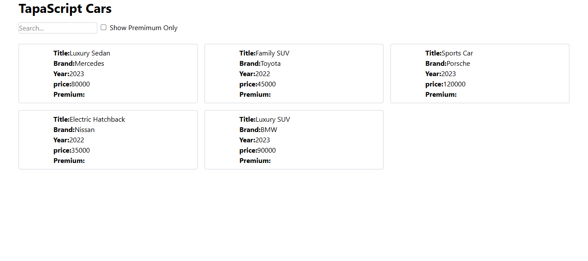

## Tapascript Cars Application 🚗
## Overview 
A sleek and interactive car listing application built with React and Tailwind CSS. This project allows users to browse various car models, filter premium cars, and search for specific vehicles.

## The UI OF Tapascript Cars
## Screenshots 📸  

## Features ✨ 
- 🔍 **Search Functionality** – Easily search for car name.  
- ✅ **Premium Car Filter** – Select to show only premium cars.   
- 🎨 **Tailwind CSS** – Fully responsive and modern UI styling. 

## Tech Stack 🛠  
- **React** – Frontend framework for UI development.  
- **Tailwind CSS** – Utility-first CSS framework for styling.

## Installation & Usage 🚀
Follow these steps to install and run the project locally: 

npm create vite@latest tapascript-cars -- --template react

## Start the development server
npm run dev
